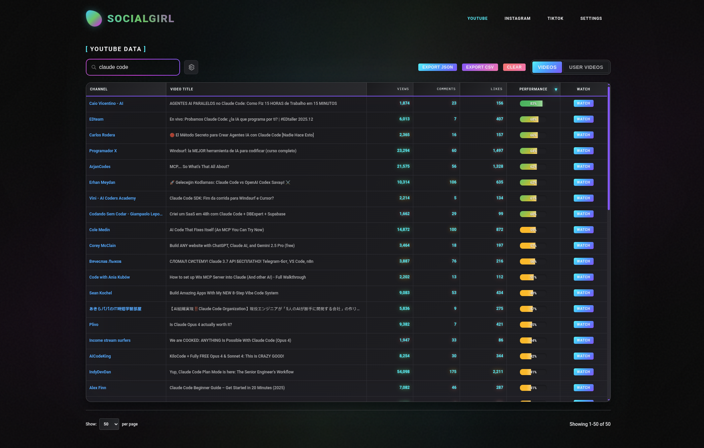

# Socialgirl



A web application that helps you track and analyze content performance across YouTube, Instagram, and TikTok. Search for videos, view engagement metrics, and monitor your API usage all in one place.

By Ken Kai does AI <https://www.skool.com/kenkai>

## What You Need Before Starting

- **Node.js** version 18 or higher
- **npm** (comes with Node.js)
- **Git** for cloning the repository

### Installing Prerequisites

**Windows:**

1. Download Node.js from <https://nodejs.org/> (choose the LTS version)
2. Run the installer and follow the prompts
3. Download Git from <https://git-scm.com/downloads>
4. Run the Git installer with default settings

**Mac:**

1. Install Homebrew if you don't have it: `/bin/bash -c "$(curl -fsSL https://raw.githubusercontent.com/Homebrew/install/HEAD/install.sh)"`
2. Install Node.js: `brew install node`
3. Install Git: `brew install git`

## Getting the App Running

### Step 1: Clone the Repository

Open Terminal (Mac) or Command Prompt (Windows) and run:

```bash
git clone https://github.com/[your-username]/Socialgirl.git
cd Socialgirl/socialgirl-app
```

### Step 2: Install Dependencies

```bash
npm install
```

This will download all the required packages (might take a minute or two).

### Step 3: Start the App

```bash
npm run dev
```

### Step 4: Open in Browser

Once you see output like:

```
  VITE v6.3.5  ready in 500 ms

  ➜  Local:   http://localhost:5173/
  ➜  Network: use --host to expose
```

Open your web browser and go to: **<http://localhost:5173>**


## Stopping the App

Press `Ctrl + C` (Windows) or `Cmd + C` (Mac) in the terminal where the app is running.

## Troubleshooting

**"npm: command not found"**

- Make sure Node.js is installed and restart your terminal

**"npm install" fails**

- Delete the `node_modules` folder and `package-lock.json` file, then try `npm install` again

**App won't start**

- Make sure port 5173 is not being used by another application
- Try `npm run dev -- --port 3000` to use a different port

**Need API Keys?**

- The app works with demo data by default
- To use real data, you'll need API keys from YouTube, Instagram, and TikTok
- Add them in the Settings page once the app is running
